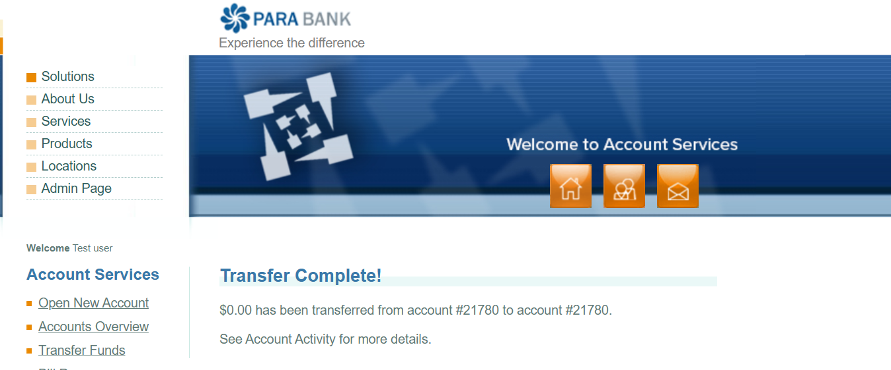

# Bug Report: ParaBank

## Bug ID: BUG_001
**Title:** System allows transfer of $0.00 between accounts without validation error
**Severity:** High
**Priority:** High
**Environment:** Chrome (Latest Version) on Windows
**Application URL:** https://parabank.parasoft.com/

---

### Description:
The system allows users to transfer $0.00 between their own accounts. In a real banking environment, this should be blocked as it creates unnecessary transaction records and could potentially cause issues with account reconciliation.

---

### Steps to Reproduce:
1. Log in to ParaBank with a valid user account.
2. Click on "Transfer Funds" in the left-hand menu.
3. Select a "From Account" (e.g., Checking) and a "To Account" (e.g., Savings).
4. Enter "0.00" in the Amount field.
5. Click the "Transfer" button.

---

### Expected Result:
The transfer should be rejected. An error message should appear stating: "Please enter an amount greater than zero."

---

### Actual Result:
A success message appears: "Transfer Complete!" The system processes the $0.00 transaction without any validation.

---

### Screenshot:

---

### Attachments:
- Bug_001_Zero_Dollar.png