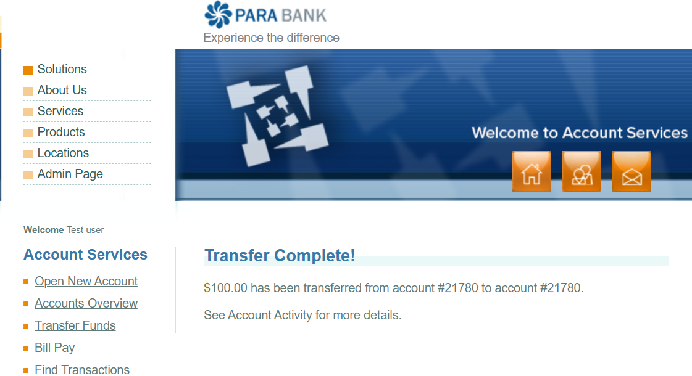

# Bug Report: ParaBank

## Bug ID: BUG_002
**Title:** System allows transfer of $100.00 when account balance is $0.00 (Unauthorized Overdraft)
**Severity:** Critical
**Priority:** High
**Environment:** Chrome (Latest Version) on Windows
**Application URL:** https://parabank.parasoft.com/

---

### Description:
The system allows users to transfer funds even when their account balance is $0.00. In a real banking environment, this should be blocked immediately as it allows users to create money without authorization, leading to severe financial reconciliation issues.

---

### Steps to Reproduce:
1. Log in to ParaBank with a valid user account.
2. Verify that the account balance is $0.00.
3. Click on "Transfer Funds" in the left-hand menu.
4. Enter an amount of "$100.00" in the Amount field.
5. Select a "From Account" and a "To Account".
6. Click the "Transfer" button.

---

### Expected Result:
The transfer should be rejected. An error message should appear stating: "Insufficient funds in your account."

---

### Actual Result:
A success message appears: "Transfer Complete!" The system processes the $100.00 transaction even though the balance was $0.00.

---

### Screenshot:

---

### Attachments:
- Screenshot of the success message (Save as `Bug_002_Overdraft_Transfer.png`)