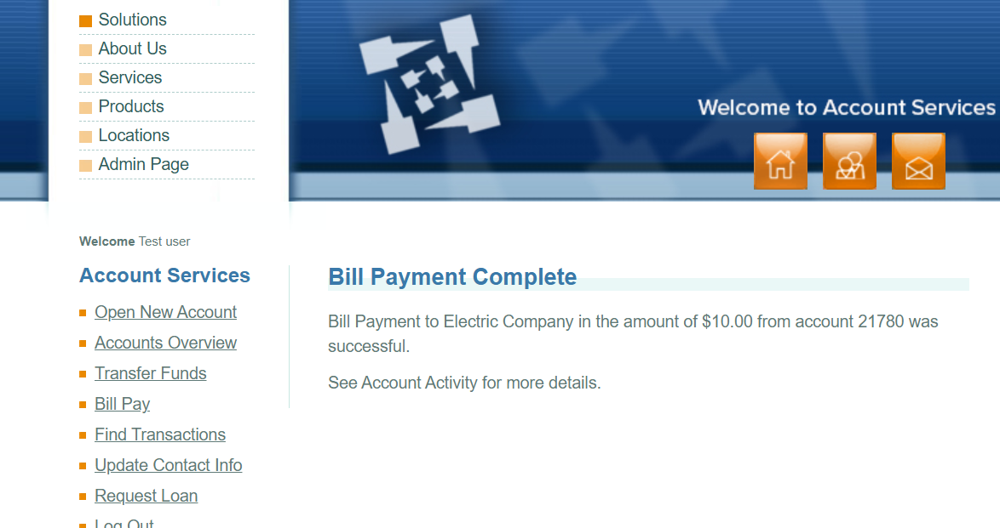

# Bug Report: ParaBank

## Bug ID: BUG_003
**Title:** System allows Bill Payment when account balance is $0.00 (Unauthorized Overdraft)
**Severity:** Critical
**Priority:** High
**Environment:** Chrome (Latest Version) on Windows
**Application URL:** https://parabank.parasoft.com/

---

### Description:
The system allows users to pay bills even when their account balance is $0.00. This is the same critical flaw identified in BUG_002 (Transfer Funds), now occurring in the Bill Pay module. Users can create money out of thin air without authorization.

---

### Steps to Reproduce:
1. Log in to ParaBank with a valid user account.
2. Verify that the account balance is $0.00.
3. Click on "Bill Pay" in the left-hand menu.
4. Enter a Payee Name (e.g., "Electric Company"), Address, and Phone.
5. Enter an amount of "$10.00".
6. Select a "From Account" (e.g., Checking).
7. Click the "Send Payment" button.

---

### Expected Result:
The payment should be rejected. An error message should appear stating: "Insufficient funds in your account."

---

### Actual Result:
A success message appears: "Bill Payment Complete! Bill Payment to Electric Company in the amount of $10.00 from account 21780 was successful."

---

### Screenshot:

---

### Attachments:
- Screenshot of the success message (Save as `Bug_003_BillPay_Overdraft.png`)